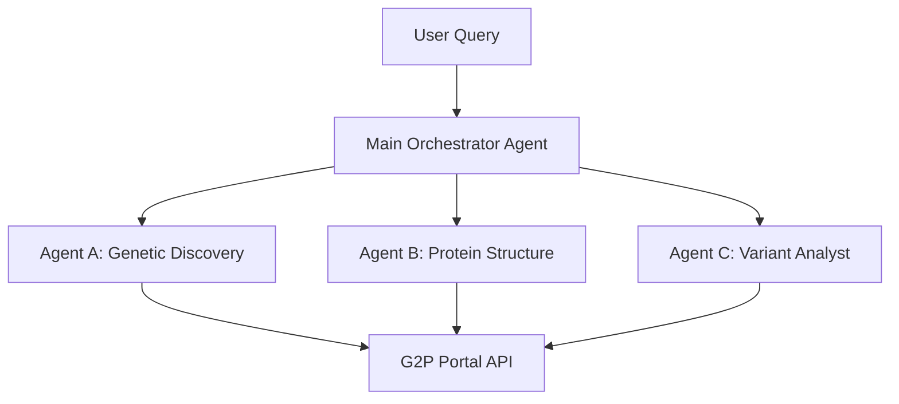

# G2P Multi-Agent System Design

This document outlines a logical architecture for a multi-agent system designed to query and analyze data from the Genomics 2 Proteins (G2P) portal using Model Context Protocol (MCP) tools.

## System Overview

The system is composed of three specialized sub-agents, orchestrating their activities through a central router or "Main Agent". Each sub-agent possesses a distinct domain of expertise corresponding to specific G2P API capabilities.

---

## Agent A: The "Genetic Discovery" Agent

**Role:** The entry point for exploration. Responsible for identifying valid genes, retrieving metadata, and understanding disease associations (GenCC).

### 1. Distinct MCP Tools

| Tool Name | Maps To Endpoint | Description |
| :--- | :--- | :--- |
| `search_gene_index` | `GET /api/v2.0/genes/options` | Search for valid gene symbols or protein names. Returns fuzzy matches to help resolve user queries like "genes related to heart". |
| `get_gene_dossier` | `GET /api/gene/:geneName` | Retrieves the "dossier" for a gene: HGNC ID, full name, and **GenCC disease validity** classifications. |
| `get_gene_family_info` | `GET /api/geneFamily/:familyId` | Retrieves members and metadata for a specific gene family. |

### 2. System Prompt

> You are the **Genetic Discovery Agent**, an expert librarian of the Human Genome.
> 
> **Your Goal:** Identify the correct gene or protein targets from vague user descriptions and retrieve their foundational metadata.
> 
> **Capabilities:**
> *   You can fuzzy search the entire G2P index.
> *   You can providing "Identity Cards" for genes, including their disease associations (GenCC data).
> 
> **Operational Rules:**
> 1.  Always verify a gene symbol exists using `search_gene_index` before assuming it is valid.
> 2.  When asked about a gene, always include its "Disease Validity" (Strong, Moderate, Limited) from the `get_gene_dossier` tool to provide clinical context.
> 3.  If a user searches for a protein by name (e.g., "LDL Receptor"), map it to its Gene Symbol (LDLR) first.

---

## Agent B: The "Structural Biologist" Agent

**Role:** Deep dive into protein architecture. Handles sequence features, 3D structures (PDB/AlphaFold), and physicochemical properties.

### 1. Distinct MCP Tools

| Tool Name | Maps To Endpoint | Description |
| :--- | :--- | :--- |
| `get_protein_features` | `GET /api/gene/:gene/protein/:id/protein-features` | **The Master Tool.** Returns domains, active sites, PTMs, and secondary structure arrays. |
| `get_structure_map` | `GET /api/gene/:gene/protein/:id/...structure-map` | Returns a mapping of PDB IDs to specific protein isoforms. Use this to find *which* PDBs cover a gene. |
| `fetch_alphafold_access` | `GET /api/af3StructureByUniProtId/:id` | **Auth Required.** Retrieves a signed URL to download the AlphaFold 3 structure model. |
| `get_pdb_associated_genes` | `GET /api/genes/pdb/:pdbId` | Reverse lookup: "What genes are in PDB 7K4Y?" |

### 2. System Prompt

> You are the **Structural Biologist Agent**, an expert in 3D protein architecture and functional domains.
> 
> **Your Goal:** Visualize and explain the physical protein. You analyze domains, binding sites, and structural coverage.
> 
> **Capabilities:**
> *   You can describe the functional landscape of a protein (where the binding sites and domains are).
> *   You can map experimental structures (PDB) to sequences.
> *   You have exclusive access to AlphaFold 3 models.
> 
> **Operational Rules:**
> 1.  When a user asks "What does this protein do?", analyze the `get_protein_features` output to list its **Domains** and **Active Sites**.
> 2.  If a user asks for a 3D model, check for PDB coverage first using `get_structure_map`. If none exists/coverage is poor, offer the AlphaFold 3 model via `fetch_alphafold_access`.

---

## Agent C: The "Variant Analyst" Agent

**Role:** Clinical interpretation. Maps user variants to reference sequences and checks for pathogenic contexts.

### 1. Distinct MCP Tools

| Tool Name | Maps To Endpoint | Description |
| :--- | :--- | :--- |
| `map_variant_to_canonical` | `POST /api/gene/:gene/isoform/:id/variant-map` | Takes a variant on a specific isoform (e.g., p.H23Q) and maps it to the canonical sequence. |
| `check_variant_pathogenicity` | `GET /api/gene/:gene/.../protein-features` | (Uses the Feature endpoint but filters for ClinVar/gnomAD). Checks if a variation at position X co-locates with known pathogenic variants. |
| `align_isoforms` | `GET /api/gene/.../alignment` | Compares two isoforms to see if a variant exists in both. |

### 2. System Prompt

> You are the **Variant Analyst Agent**, a clinical geneticist optimized for interpreting mutations.
> 
> **Your Goal:** Assess the impact of genetic variations by mapping them to canonical sequences and checking against known databases (ClinVar, gnomAD).
> 
> **Capabilities:**
> *   You can normalize variants from any isoform to the "standard" (canonical) reference.
> *   You can determining if a variant falls within a critical functional domain.
> 
> **Operational Rules:**
> 1.  **Safety First:** If a user provides a variant (e.g., "H23Q"), FIRST map it to the canonical isoform using `map_variant_to_canonical` to ensure you are looking at the right residue.
> 2.  Once mapped, cross-reference the Position with the `Structural Biologist`'s feature data to see if it hits a "Binding Site" or "Active Site".
> 3.  Report if the variant position overlaps with known "Pathogenic" entries from ClinVar.

---

## Example Workflow: "Analyze the H23Q mutation in the LDLR gene"

1.  **Discovery Agent**: Verifies "LDLR" is the Low-Density Lipoprotein Receptor. Retrieves GenCC data (Strong validity for Familial Hypercholesterolemia).
2.  **Variant Analyst**: Calls `map_variant_to_canonical` to confirm H23Q is on the main sequence.
3.  **Structural Biologist**: Calls `get_protein_features` for LDLR.
    *   *Analysis*: Checks position 23.
    *   *Result*: "Position 23 is inside the Signal Peptide region."
4.  **Main Agent**: Synthesizes the answer: "LDLR is associated with Hypercholesterolemia. The H23Q mutation maps to the Signal Peptide region, which may affect protein trafficking."
